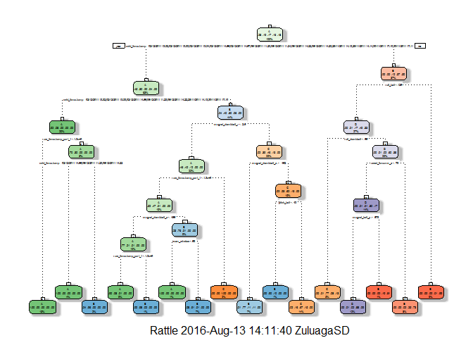

# Practical Machine Learning - Prediction Assignment Writeup

## Background

Using devices such as Jawbone Up, Nike FuelBand, and Fitbit it is now possible to collect a large amount of data about personal activity relatively inexpensively. These type of devices are part of the quantified self movement - a group of enthusiasts who take measurements about themselves regularly to improve their health, to find patterns in their behavior, or because they are tech geeks. One thing that people regularly do is quantify how much of a particular activity they do, but they rarely quantify how well they do it. In this project, your goal will be to use data from accelerometers on the belt, forearm, arm, and dumbell of 6 participants. They were asked to perform barbell lifts correctly and incorrectly in 5 different ways. More information is available from the website here: http://groupware.les.inf.puc-rio.br/har (see the section on the Weight Lifting Exercise Dataset).


### First lets load the required libraries:


```r
library(caret)
library(rpart)
library(rattle)
library(randomForest)
```

#### Download the data if we dont have it already:


```r
rm(list = ls())
if (!file.exists("pml-training.csv")) {
  download.file("http://d396qusza40orc.cloudfront.net/predmachlearn/pml-training.csv", destfile = "pml-training.csv")
}
if (!file.exists("pml-testing.csv")) {
  download.file("http://d396qusza40orc.cloudfront.net/predmachlearn/pml-testing.csv", destfile = "pml-testing.csv")
}
training  <- read.csv("pml-training.csv", sep = ",", na.strings = c("", "NA"))
testing  <- read.csv("pml-testing.csv", sep = ",", na.strings = c("", "NA"))
```

### Split the training set:

We are going to split the training data set into two data sets, 60% for training and 40% for testing.


```r
set.seed(98765)
inTrain <- createDataPartition(y=training$classe, p=0.6, list=FALSE)
myTraining <- training[inTrain, ]
myTesting <- training[-inTrain, ]
dim(myTraining); dim(myTesting)
```

```
## [1] 11776   160
```

```
## [1] 7846  160
```

### Data cleaning:

Lets see what NZV features do we have and remove them.


```r
myDataNZV <- nearZeroVar(myTraining, saveMetrics=TRUE)
```


```r
myNZVvars <- names(myTraining) %in% rownames(myDataNZV[myDataNZV$nzv == "TRUE", ])
myTraining <- myTraining[!myNZVvars]
myTraining <- myTraining[c(-1)]
dim(myTraining)
```

```
## [1] 11776   122
```

Now lets remove the features that have more than 60% NAs values.


```r
trainingV3 <- myTraining
for(i in 1:length(myTraining)) { 
        if( sum( is.na(myTraining[, i] ) ) / nrow(myTraining) >= .6 ) { 
        for(j in 1:length(trainingV3)) {
            if( length(grep(names(myTraining[i]), names(trainingV3)[j]) ) == 1) {
                trainingV3 <- trainingV3[ , -j]
            }   
        } 
    }
}

myTraining <- trainingV3
dim(myTraining)
```

```
## [1] 11776    58
```


### Machine learning, Decision Tree:

Lets try to predict the diferent types of exercises with a simple decision tree.


```r
modFitA1 <- rpart(classe ~ ., data=myTraining, method="class")
```

This is what the decision tree looks like:


```r
fancyRpartPlot(modFitA1)
```

<!-- -->

And lets see the results we got:


```r
predictionsA1 <- predict(modFitA1, myTesting, type = "class")
confusionMatrix(predictionsA1, myTesting$classe)
```

```
## Confusion Matrix and Statistics
## 
##           Reference
## Prediction    A    B    C    D    E
##          A 2151   70    6    4    0
##          B   62 1262   84   67    0
##          C   19  178 1260  206   55
##          D    0    8    8  807   78
##          E    0    0   10  202 1309
## 
## Overall Statistics
##                                           
##                Accuracy : 0.8653          
##                  95% CI : (0.8575, 0.8728)
##     No Information Rate : 0.2845          
##     P-Value [Acc > NIR] : < 2.2e-16       
##                                           
##                   Kappa : 0.8295          
##  Mcnemar's Test P-Value : NA              
## 
## Statistics by Class:
## 
##                      Class: A Class: B Class: C Class: D Class: E
## Sensitivity            0.9637   0.8314   0.9211   0.6275   0.9078
## Specificity            0.9857   0.9663   0.9293   0.9857   0.9669
## Pos Pred Value         0.9641   0.8556   0.7334   0.8957   0.8606
## Neg Pred Value         0.9856   0.9598   0.9824   0.9310   0.9790
## Prevalence             0.2845   0.1935   0.1744   0.1639   0.1838
## Detection Rate         0.2742   0.1608   0.1606   0.1029   0.1668
## Detection Prevalence   0.2843   0.1880   0.2190   0.1148   0.1939
## Balanced Accuracy      0.9747   0.8988   0.9252   0.8066   0.9373
```

Now lets predict with 500 trees using the default randomForest function:


```r
modFitB1 <- randomForest(classe ~. , data=myTraining)
predictionsB1 <- predict(modFitB1, myTesting, type = "class")
```

And lets see the results obtained with randomForest:


```r
confusionMatrix(predictionsB1, myTesting$classe)
```

```
## Confusion Matrix and Statistics
## 
##           Reference
## Prediction    A    B    C    D    E
##          A 2232    2    0    0    0
##          B    0 1516    2    0    0
##          C    0    0 1366    4    0
##          D    0    0    0 1281    0
##          E    0    0    0    1 1442
## 
## Overall Statistics
##                                           
##                Accuracy : 0.9989          
##                  95% CI : (0.9978, 0.9995)
##     No Information Rate : 0.2845          
##     P-Value [Acc > NIR] : < 2.2e-16       
##                                           
##                   Kappa : 0.9985          
##  Mcnemar's Test P-Value : NA              
## 
## Statistics by Class:
## 
##                      Class: A Class: B Class: C Class: D Class: E
## Sensitivity            1.0000   0.9987   0.9985   0.9961   1.0000
## Specificity            0.9996   0.9997   0.9994   1.0000   0.9998
## Pos Pred Value         0.9991   0.9987   0.9971   1.0000   0.9993
## Neg Pred Value         1.0000   0.9997   0.9997   0.9992   1.0000
## Prevalence             0.2845   0.1935   0.1744   0.1639   0.1838
## Detection Rate         0.2845   0.1932   0.1741   0.1633   0.1838
## Detection Prevalence   0.2847   0.1935   0.1746   0.1633   0.1839
## Balanced Accuracy      0.9998   0.9992   0.9990   0.9981   0.9999
```

And we got 99% accuracy!
